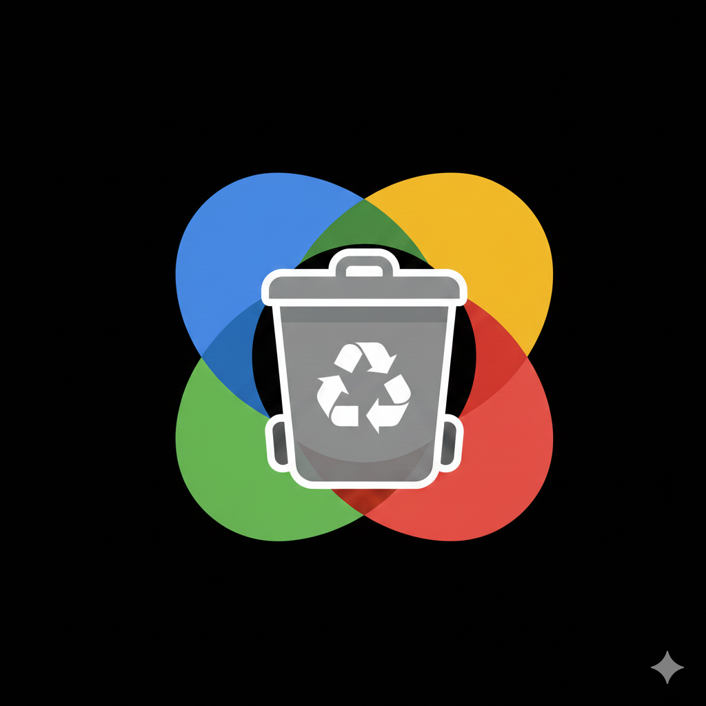

#  GPEmpty - nuke your Google Photos library

**Version:** 1.0.0

GPEmpty is an Android application designed to automate the management and cleaning of Google Photos libraries. It uses a hybrid approach with a native Android WebView to interact with the Google Photos web interface, allowing for mass deletion and library maintenance.

## Features
- **Automated Deletion**: Selecting massive batches of photos and deleting them automatically.
- **Smart Daily Schedule**: Runs a passive check every ~4 hours (8 AM - 10 PM) to clean your library.
- **Doze Friendly**: If your phone is sleeping, the app waits until you wake it up (plus a 2-minute "grace period") before running.
- **Persistence**: Uses a foreground service to ensure the schedule keeps running in the background.
- **Skip Today Mode**: Intelligently skips "Today's" photos to prevent accidental deletion of recent memories.
- **Immediate Trash Emptying**: Automatically navigates to Trash and empties it after every batch deletion.
- **Activity Logging**: Keeps a 7-day history of all deletions and runs.
- **Stealth Mode**: Mimics human behavior and browser headers to bypass Google Photos' automation blocks.

## Documentation
- **[User Guide](USER_GUIDE.md)**: Installation, setup, and usage instructions.
- **[Architecture](ARCHITECTURE.md)**: Technical overview of the internal design and automation logic.

## Build
Built with Android SDK 34 (UpsideDownCake).
